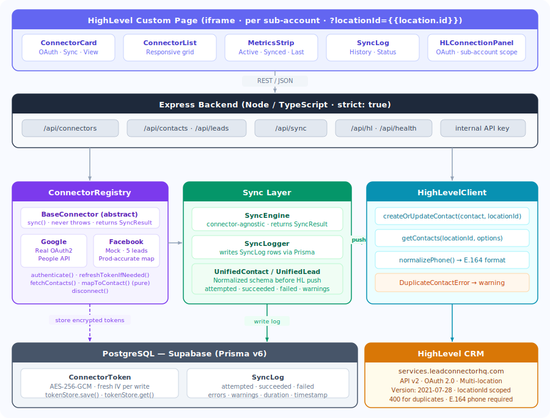
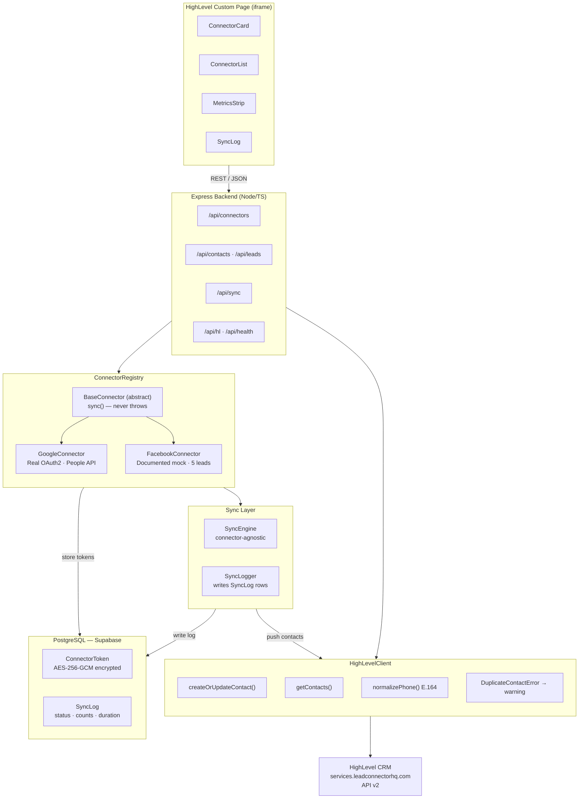

# Nexus — HighLevel Integration Platform

A connector abstraction and normalization layer that connects third-party apps (Google Contacts, Facebook Lead Ads) to HighLevel CRM. This is **not** a workflow builder — think Merge.dev, not Zapier.

---

## Documentation

| Document | Description |
|---|---|
| [docs/PRD.md](docs/PRD.md) | Product Requirements Document — problem statement, schema definitions, API design, success metrics |
| [docs/AI_SDLC.md](docs/AI_SDLC.md) | AI-First SDLC — how AI was used at every stage, exact prompts, orchestration strategy, trade-offs |
| [AGENTS.md](AGENTS.md) | Universal agent context — paste into any AI model to onboard it to this codebase |
| [CLAUDE.md](CLAUDE.md) | Claude Code context — auto-loaded, critical rules and sharp edges |

---

## Architecture



<details><summary>Mermaid source</summary>



</details>

---

## Connector Design

All connectors extend `BaseConnector` and implement five abstract methods:

| Method | Purpose |
|---|---|
| `authenticate(code)` | Exchange OAuth code for tokens, store encrypted |
| `refreshTokenIfNeeded()` | Check expiry, refresh if within 5 min |
| `fetchContacts(options?)` | Call external API, map each result |
| `mapToContact(raw)` | Pure mapping — raw API response → UnifiedContact |
| `disconnect()` | Clear tokens, mark disconnected |

### Adding a new connector in 4 steps

1. Create `src/connectors/yourapp.connector.ts` extending `BaseConnector`
2. Implement all 5 abstract methods
3. Register in `connector.registry.ts`
4. Add OAuth env vars to `.env.example`

The `sync()` method is inherited from `BaseConnector` — no sync logic needed in the connector itself.

---

## Schema Normalization

### Facebook Lead → UnifiedContact

| Facebook field | UnifiedContact field | Notes |
|---|---|---|
| `id` | `sourceId` | |
| `field_data[full_name].values[0]` | `firstName` + `lastName` | Split on first space |
| `field_data[email].values[0]` | `email` | |
| `field_data[phone_number].values[0]` | `phone` | Optional |
| `field_data[campaign_id].values[0]` | `campaignId` | UnifiedLead extension |
| `field_data[ad_id].values[0]` | `adId` | UnifiedLead extension |
| `'facebook'` | `source` | Hardcoded |
| `['facebook-lead']` | `tags` | Hardcoded |
| Full lead object | `raw` | Always preserved |

---

## AI Usage Across SDLC

### PRD Generation
```
Prompt: "You are a senior product manager. I need a PRD for a connector abstraction 
platform similar to Merge.dev that connects to Google Contacts and Facebook Lead Ads 
and syncs normalized data into HighLevel CRM. Include: problem statement, user stories, 
success metrics, non-goals (not a workflow builder), API shape, and MVP scope."
```

### Schema Design
```
Prompt: "Design a TypeScript UnifiedContact interface that can represent contacts from 
Google People API, Facebook Lead Ads, and Stripe Customers without losing any source-specific 
fields. It must preserve the original payload, support optional fields, and extend cleanly 
for lead-specific fields like campaignId and adId."
```

### Connector Scaffolding
```
Prompt: "Generate an abstract BaseConnector class in TypeScript with these abstract methods: 
authenticate, refreshTokenIfNeeded, fetchContacts, mapToContact, disconnect. 
The concrete sync() method should call fetchContacts → push each to HighLevel → log results → 
return SyncResult. It must never throw — always return partial success."
```

### Test Generation
```
Prompt: "Write Jest unit tests for GoogleConnector.mapToContact() and 
FacebookConnector.mapToContact(). Use realistic API response fixtures. 
Test: full mapping, missing optional fields, empty arrays, raw field preservation, 
source field value. No mocking of external APIs — these are pure functions."
```

### Edge Case Discovery
```
Prompt: "What are the top 10 edge cases a developer would miss when building a contact 
sync engine that reads from Google People API and writes to HighLevel CRM? 
Think about: auth token expiry, rate limits, duplicate contacts, missing fields, 
partial failures, and concurrent syncs."
```

---

## Mock vs Real

| Component | Status | Reason |
|---|---|---|
| Google OAuth | Real | Full OAuth2 PKCE flow with real scopes |
| Google People API | Real | Calls live API with real token |
| Facebook OAuth | Mocked | App Review takes 2-4 weeks |
| Facebook Lead Ads API | Mocked | Requires approved app + webhook subscription |
| HighLevel OAuth | Real | App-level OAuth 2.0, multi-location, token auto-refresh |
| Token encryption | Real | AES-256-GCM via Node crypto |
| Prisma + PostgreSQL | Real (config required) | Needs `DATABASE_URL` |

---

## Known Limitations

- No webhook support for real-time sync (Facebook Lead Ads webhooks require verified app)
- No scheduled/background sync (would need a job runner like BullMQ or pg-cron)
- No user auth — internal API key is a single shared secret
- Facebook connector is fully mocked; production requires Facebook App Review
- Contacts without an email address are still attempted (HL accepts null email but rejects empty string — omitted from body)

---

## Running Locally

```bash
# 1. Copy env file and fill in values
cp backend/.env.example backend/.env

# 2. Generate Prisma client and push schema
cd backend
npm run db:generate
npm run db:push

# 3. Start backend (port 3000)
npm run dev

# 4. In another terminal, start frontend (port 5173)
cd ../frontend
npm run dev
```

Visit http://localhost:5173 to see the UI.

---

## Deploying to Railway

```bash
# 1. Push project to GitHub

# 2. Create Railway project, add PostgreSQL service
#    Copy DATABASE_URL from Railway PostgreSQL service

# 3. Create backend service from GitHub repo
#    Set root directory: backend
#    Set start command: npm start
#    Add all environment variables from .env.example

# 4. Run migrations on first deploy:
#    railway run npm run db:migrate

# 5. Note the Railway URL (e.g. https://your-app.railway.app)
#    Set VITE_API_BASE_URL in frontend build
```

---

## Embedding in HighLevel

Nexus runs inside HighLevel as a **Custom Page** (iframe) — not Custom JS. This gives it a dedicated sidebar entry per sub-account.

```bash
# 1. In HL Marketplace app settings → App Modules → Custom Page
#    Set URL: https://your-app.railway.app?locationId={{location.id}}
#    Placement: Sub-account navigation (left sidebar)

# 2. The app auto-scopes to the current sub-account via ?locationId
#    window.opener detection handles install vs manual connect flows
```

The React app mounts to `#nexus-app` (injected by the Custom Page iframe) and falls back to `#root` for local dev.
