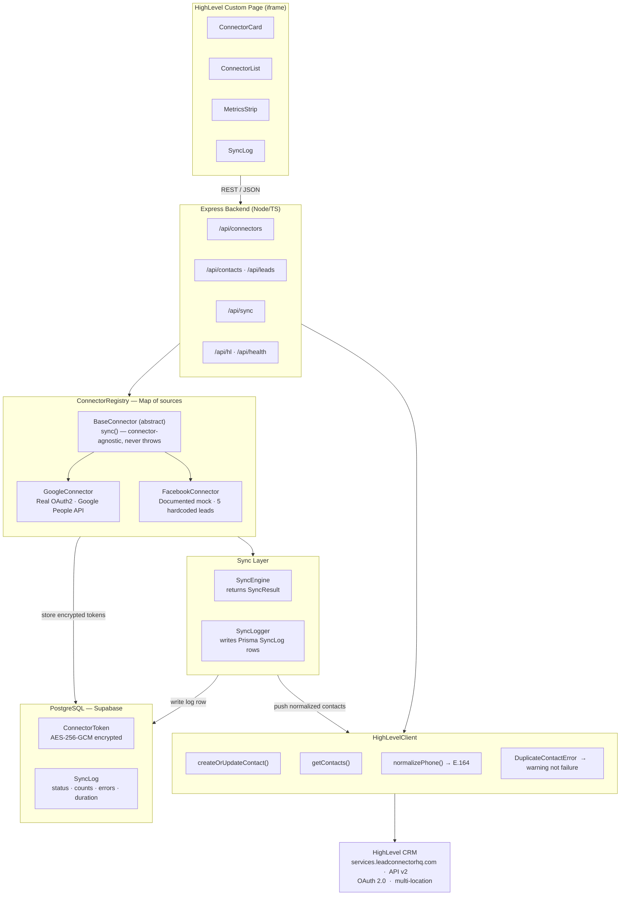

# Product Requirements Document
## Nexus — Integration Platform for HighLevel

**Version:** 1.0  
**Status:** Implemented  
**Author:** Shresthdeep Gupta  
**AI Assistance:** Claude Sonnet 4.6 (Claude Code)

---

## 1. Problem Statement

HighLevel is a powerful CRM and marketing platform, but it exists in isolation from the tools businesses already use. Sales teams capture leads in Facebook Lead Ads, customer data lives in Google Contacts, and financial records sit in Stripe — but none of this flows into HighLevel automatically.

Existing solutions are either workflow builders (Zapier, Make) that require per-field mapping by non-technical users, or point-to-point integrations that cannot scale across multiple sources. Neither provides a **unified data model** that normalizes third-party data before it reaches the CRM.

**The gap:** There is no abstraction layer that sits between external APIs and HighLevel, normalizes their schemas, and syncs clean, structured data on demand.

---

## 2. Product Vision

**Nexus** is a connector abstraction and normalization platform — closer to [Merge.dev](https://merge.dev) than Zapier.

> "Connect any external data source, normalize it to a unified schema, sync it to HighLevel CRM."

It is **not** a workflow builder. It does not route events or trigger automations. It normalizes structured records (contacts, leads, companies, deals) and pushes them into HighLevel in a consistent format.

---

## 3. Goals and Non-Goals

### Goals
- Provide a unified `UnifiedContact` / `UnifiedLead` schema that any connector maps to
- Support real OAuth2 connectors (Google) and mock connectors (Facebook, Stripe)
- Push normalized data to HighLevel CRM via their v2 REST API
- Expose a consistent internal REST API regardless of which connector is active
- Provide an embeddable React UI that works inside HighLevel via Custom JS
- Log all sync operations with status, counts, errors, warnings, and duration

### Non-Goals
- Workflow automation or event routing (not Zapier)
- Real-time webhooks (future scope)
- Two-way sync (HighLevel → external app)
- User authentication (internal platform, API key protected)

---

## 4. Users

| User | Context | Need |
|---|---|---|
| Sales ops / founder | Small HL agency or business | Pull contacts from Facebook ads into HL without manual CSV export |
| Developer / technical operator | Building on top of HL | Add new connectors without touching sync logic |
| Agency admin | Manages HL for clients | See sync history, debug failures, manage connections |

---

## 5. System Architecture


<details><summary>Mermaid source</summary>



</details>


---

## 6. Unified Schema Definitions

### 6.1 UnifiedContact
```typescript
interface UnifiedContact {
  id: string                           // internal UUID
  source: ConnectorSource              // 'google' | 'facebook' | 'stripe_mock'
  sourceId: string                     // original record ID from the source API
  firstName: string
  lastName: string
  email: string
  phone?: string                       // E.164 format, normalized before HL push
  company?: string
  tags?: string[]
  customFields?: Record<string, unknown>
  syncedAt?: Date
  raw: Record<string, unknown>         // always preserve the original payload
}
```

### 6.2 UnifiedLead (extends UnifiedContact)
```typescript
interface UnifiedLead extends UnifiedContact {
  leadSource?: string
  campaignId?: string
  formId?: string
  adId?: string
}
```

### 6.3 SyncResult
```typescript
interface SyncResult {
  connectorSource: ConnectorSource
  attempted: number
  succeeded: number    // includes duplicates (skipped, not failed)
  failed: number
  errors: SyncError[]  // real failures → failed++
  warnings: SyncError[] // duplicates skipped → succeeded++
  timestamp: Date
}
```

### 6.4 Planned Extensions (future)
```typescript
interface UnifiedCompany {
  id: string; source: ConnectorSource; sourceId: string
  name: string; domain?: string; industry?: string
  phone?: string; address?: string
  raw: Record<string, unknown>
}

interface UnifiedDeal {
  id: string; source: ConnectorSource; sourceId: string
  name: string; value?: number; currency?: string
  stage?: string; contactEmail?: string
  raw: Record<string, unknown>
}
```

---

## 7. Connector Abstraction Layer

Every connector extends `BaseConnector` and implements exactly 5 methods:

```typescript
abstract class BaseConnector {
  abstract authenticate(code: string): Promise<void>
  abstract refreshTokenIfNeeded(): Promise<void>
  abstract fetchContacts(options?: FetchOptions): Promise<UnifiedContact[]>
  abstract mapToContact(raw: unknown): UnifiedContact
  abstract disconnect(): Promise<void>

  // Inherited — never re-implement:
  async sync(hlClient, dbLog, options): Promise<SyncResult> // never throws
  getStatus(): ConnectorStatus
}
```

**Adding a new connector requires no changes to:**
- SyncEngine
- Routes
- HighLevelClient
- Frontend (except adding an icon/label)

---

## 8. Connector Status: Mock vs Real

| Connector | Status | Auth | Why |
|---|---|---|---|
| Google Contacts | Real | OAuth2 PKCE | Full Google People API |
| Facebook Lead Ads | Mock (documented) | Simulated | App Review takes 2–4 weeks |
| Stripe | Mock scaffold | API key (planned) | `stripe_mock` in ConnectorSource |

---

## 9. API Design

All responses: `{ success: boolean, data?: T, error?: string }`

| Endpoint | Purpose |
|---|---|
| `GET /api/health` | Liveness check |
| `GET /api/connectors` | List all connectors + status |
| `POST /api/connectors/:source/connect` | Initiate connection / return authUrl |
| `DELETE /api/connectors/:source/disconnect` | Clear tokens, mark disconnected |
| `GET /api/contacts?source=&limit=&skip=` | Fetch normalized contacts |
| `POST /api/sync/:source` | Trigger sync (supports `dryRun`) |
| `GET /api/sync/logs?source=&limit=` | Fetch sync history |
| `GET /api/connectors/:source/callback?code=` | OAuth redirect handler |

---

## 10. Success Metrics

| Metric | Target |
|---|---|
| Contacts synced per run | All available records |
| Duplicate handling | Skipped with warning, not failed |
| Sync failure rate | 0% on valid records |
| API response time | < 500ms for status/log endpoints |
| Test coverage | Unit + integration on all core paths |
| TypeScript errors | Zero (`strict: true`) |

---

## 11. Limitations & Future Improvements

### Current Limitations
- No real-time sync (no webhooks — Facebook requires verified app)
- No scheduled/background sync (would need BullMQ or pg-cron)
- Single location scope (no multi-tenant support)
- Facebook connector is fully mocked
- No user authentication (internal API key only)
- No two-way sync (HighLevel → external app)
- Custom fields in HL require manual creation before they can be populated

### Future Improvements
| Feature | Value |
|---|---|
| Stripe connector (real) | `UnifiedContact` from customers + `UnifiedDeal` from subscriptions |
| HubSpot connector | Multi-entity: contacts, companies, deals |
| `UnifiedCompany` schema + HL sync | Richer CRM data model |
| Scheduled sync (cron) | Auto-pull on interval without manual trigger |
| Webhook ingestion | Real-time lead capture from Facebook/Typeform |
| Conflict resolution | Field-level merge strategy on duplicates |
| Multi-location support | Agency-level deployment |
